# Process Flow Documentation

## Multi-Agent Documentation Automation System

**Version**: 1.0  
**Date**: December 13, 2025  
**Project**: ClientPass Documentation Automation

---

## 1. OVERVIEW

### 1.1 Purpose

This document provides comprehensive process flow diagrams and documentation for the Multi-Agent Documentation Automation System (MAS), detailing how information flows between components, agents, and external systems.

### 1.2 Scope

The process flows cover:

- End-to-end documentation automation workflows
- Agent interaction patterns and communication flows
- Data transformation and storage processes
- Error handling and recovery procedures
- Performance optimization pathways

### 1.3 Flow Notation

- **→**: Synchronous process flow
- **⤷**: Asynchronous process flow
- **◊**: Decision point
- **○**: Process start/end
- **□**: Process step
- **⬢**: External system
- **△**: Data store

---

## 2. HIGH-LEVEL SYSTEM FLOW

### 2.1 Master Process Flow

```mermaid
graph TD
    A[○ Source Code Change] --> B[□ Change Detection Agent]
    B --> C[◊ Change Relevant?]
    C -->|Yes| D[□ Document Management Agent]
    C -->|No| E[□ Log & Ignore]
    D --> F[□ AI Content Generation]
    F --> G[□ Local File Update]
    G --> H[□ RAG Management Agent]
    H --> I[□ Vector Embedding Generation]
    I --> J[△ MongoDB Atlas Vector Store]
    G --> K[□ MongoDB Docs Sync]
    K --> L[△ MongoDB Docs Database]
    L --> M[□ Git Operations]
    M --> N[□ Production Deployment]
    N --> O[○ Process Complete]

    H --> P[□ Logging Audit Agent]
    P --> Q[△ Audit Logs]

    R[□ Scheduler Agent] ⤷ B
    R ⤷ H
    R ⤷ P
```

### 2.2 Agent Orchestration Flow

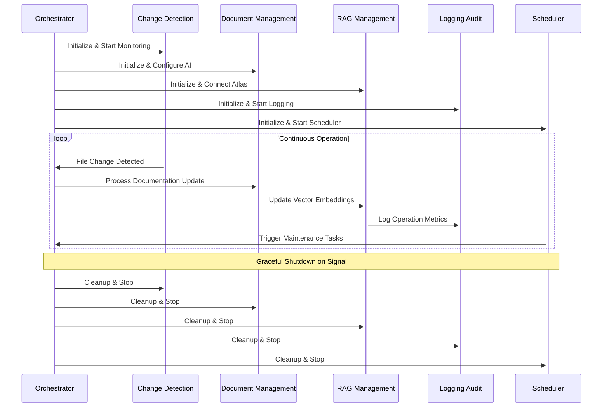
```mermaid
sequenceDiagram
    participant O as Orchestrator
    participant C as Change Detection
    participant D as Document Management
    participant R as RAG Management
    participant L as Logging Audit
    participant S as Scheduler

    O->>+C: Initialize & Start Monitoring
    O->>+D: Initialize & Configure AI
    O->>+R: Initialize & Connect Atlas
    O->>+L: Initialize & Start Logging
    O->>+S: Initialize & Start Scheduler

    loop Continuous Operation
        C->>O: File Change Detected
        O->>D: Process Documentation Update
        D->>R: Update Vector Embeddings
        R->>L: Log Operation Metrics
        S->>O: Trigger Maintenance Tasks
    end

    Note over O,S: Graceful Shutdown on Signal
    O->>C: Cleanup & Stop
    O->>D: Cleanup & Stop
    O->>R: Cleanup & Stop
    O->>L: Cleanup & Stop
    O->>S: Cleanup & Stop
```

---

## 3. CHANGE DETECTION PROCESS FLOW

### 3.1 File System Monitoring Flow

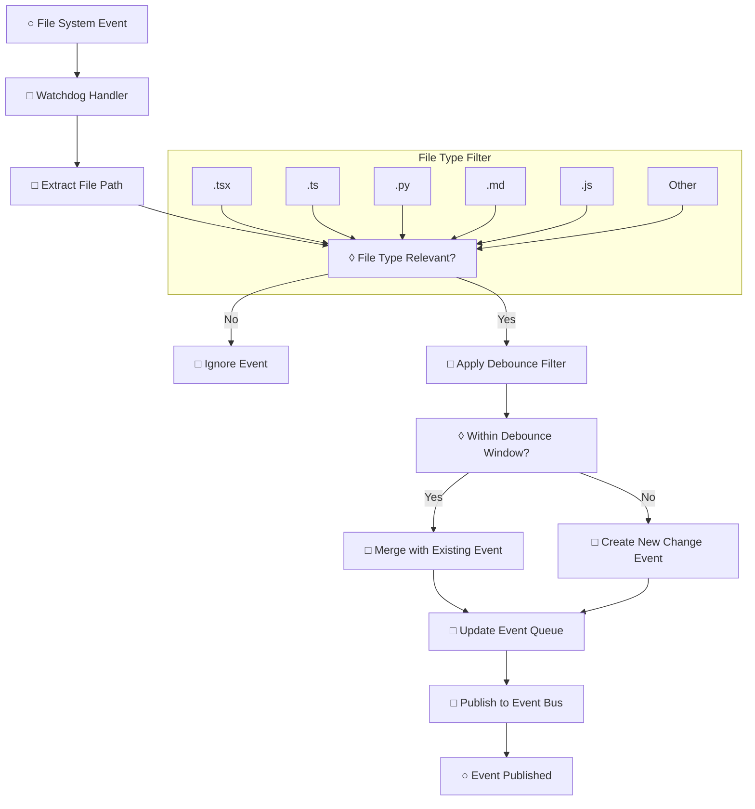
```mermaid
graph TD
    A[○ File System Event] --> B[□ Watchdog Handler]
    B --> C[□ Extract File Path]
    C --> D[◊ File Type Relevant?]
    D -->|No| E[□ Ignore Event]
    D -->|Yes| F[□ Apply Debounce Filter]
    F --> G[◊ Within Debounce Window?]
    G -->|Yes| H[□ Merge with Existing Event]
    G -->|No| I[□ Create New Change Event]
    H --> J[□ Update Event Queue]
    I --> J
    J --> K[□ Publish to Event Bus]
    K --> L[○ Event Published]

    subgraph "File Type Filter"
        M[.tsx] --> D
        N[.ts] --> D
        O[.py] --> D
        P[.md] --> D
        Q[.js] --> D
        R[Other] --> D
    end
```

### 3.2 Git Repository Monitoring Flow

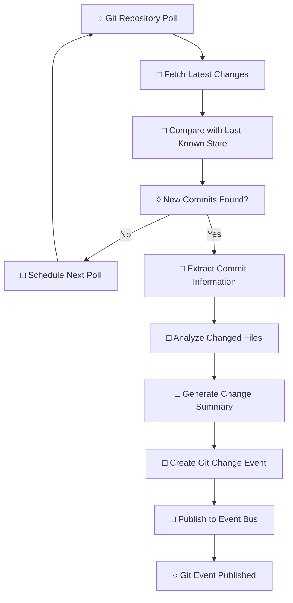
```mermaid
graph TD
    A[○ Git Repository Poll] --> B[□ Fetch Latest Changes]
    B --> C[□ Compare with Last Known State]
    C --> D[◊ New Commits Found?]
    D -->|No| E[□ Schedule Next Poll]
    D -->|Yes| F[□ Extract Commit Information]
    F --> G[□ Analyze Changed Files]
    G --> H[□ Generate Change Summary]
    H --> I[□ Create Git Change Event]
    I --> J[□ Publish to Event Bus]
    J --> K[○ Git Event Published]
    E --> A
```

### 3.3 Debounce Logic Flow

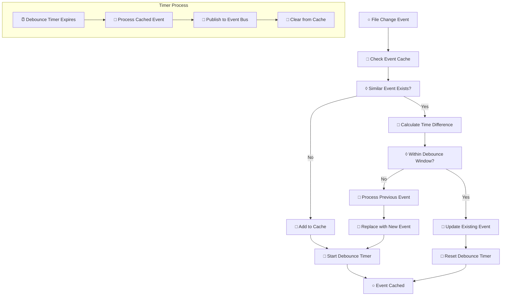
```mermaid
graph TD
    A[○ File Change Event] --> B[□ Check Event Cache]
    B --> C[◊ Similar Event Exists?]
    C -->|No| D[□ Add to Cache]
    C -->|Yes| E[□ Calculate Time Difference]
    E --> F[◊ Within Debounce Window?]
    F -->|Yes| G[□ Update Existing Event]
    F -->|No| H[□ Process Previous Event]
    H --> I[□ Replace with New Event]
    D --> J[□ Start Debounce Timer]
    G --> K[□ Reset Debounce Timer]
    I --> J
    J --> L[○ Event Cached]
    K --> L

    subgraph "Timer Process"
        M[⏰ Debounce Timer Expires] --> N[□ Process Cached Event]
        N --> O[□ Publish to Event Bus]
        O --> P[□ Clear from Cache]
    end
```

---

## 4. DOCUMENT MANAGEMENT PROCESS FLOW

### 4.1 Documentation Generation Flow

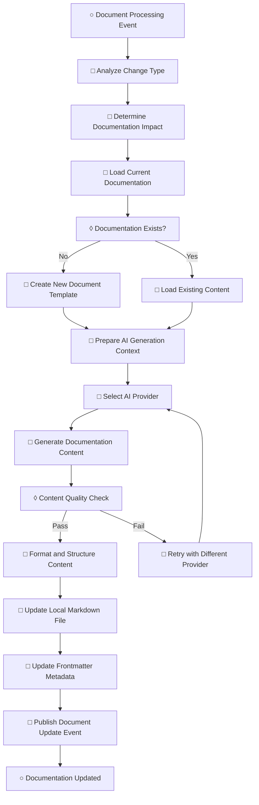
```mermaid
graph TD
    A[○ Document Processing Event] --> B[□ Analyze Change Type]
    B --> C[□ Determine Documentation Impact]
    C --> D[□ Load Current Documentation]
    D --> E[◊ Documentation Exists?]
    E -->|No| F[□ Create New Document Template]
    E -->|Yes| G[□ Load Existing Content]
    F --> H[□ Prepare AI Generation Context]
    G --> H
    H --> I[□ Select AI Provider]
    I --> J[□ Generate Documentation Content]
    J --> K[◊ Content Quality Check]
    K -->|Pass| L[□ Format and Structure Content]
    K -->|Fail| M[□ Retry with Different Provider]
    M --> I
    L --> N[□ Update Local Markdown File]
    N --> O[□ Update Frontmatter Metadata]
    O --> P[□ Publish Document Update Event]
    P --> Q[○ Documentation Updated]
```

### 4.2 AI Provider Selection Flow

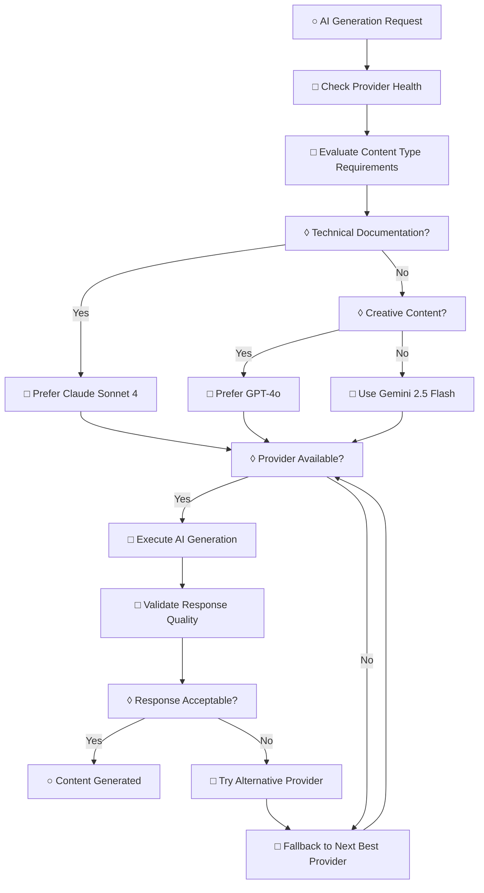
```mermaid
graph TD
    A[○ AI Generation Request] --> B[□ Check Provider Health]
    B --> C[□ Evaluate Content Type Requirements]
    C --> D[◊ Technical Documentation?]
    D -->|Yes| E[□ Prefer Claude Sonnet 4]
    D -->|No| F[◊ Creative Content?]
    F -->|Yes| G[□ Prefer GPT-4o]
    F -->|No| H[□ Use Gemini 2.5 Flash]
    E --> I[◊ Provider Available?]
    G --> I
    H --> I
    I -->|Yes| J[□ Execute AI Generation]
    I -->|No| K[□ Fallback to Next Best Provider]
    K --> I
    J --> L[□ Validate Response Quality]
    L --> M[◊ Response Acceptable?]
    M -->|Yes| N[○ Content Generated]
    M -->|No| O[□ Try Alternative Provider]
    O --> K
```

### 4.3 Content Quality Validation Flow

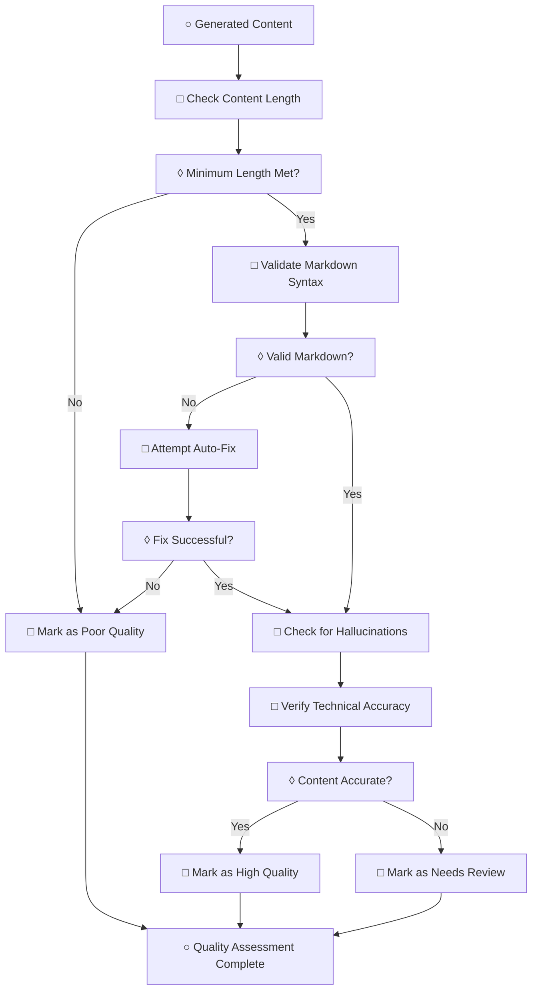
```mermaid
graph TD
    A[○ Generated Content] --> B[□ Check Content Length]
    B --> C[◊ Minimum Length Met?]
    C -->|No| D[□ Mark as Poor Quality]
    C -->|Yes| E[□ Validate Markdown Syntax]
    E --> F[◊ Valid Markdown?]
    F -->|No| G[□ Attempt Auto-Fix]
    F -->|Yes| H[□ Check for Hallucinations]
    G --> I[◊ Fix Successful?]
    I -->|No| D
    I -->|Yes| H
    H --> J[□ Verify Technical Accuracy]
    J --> K[◊ Content Accurate?]
    K -->|Yes| L[□ Mark as High Quality]
    K -->|No| M[□ Mark as Needs Review]
    D --> N[○ Quality Assessment Complete]
    L --> N
    M --> N
```

---

## 5. RAG MANAGEMENT PROCESS FLOW

### 5.1 Vector Embedding Generation Flow

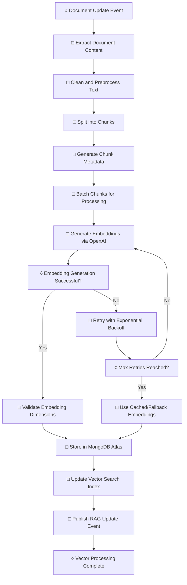
```mermaid
graph TD
    A[○ Document Update Event] --> B[□ Extract Document Content]
    B --> C[□ Clean and Preprocess Text]
    C --> D[□ Split into Chunks]
    D --> E[□ Generate Chunk Metadata]
    E --> F[□ Batch Chunks for Processing]
    F --> G[□ Generate Embeddings via OpenAI]
    G --> H[◊ Embedding Generation Successful?]
    H -->|No| I[□ Retry with Exponential Backoff]
    H -->|Yes| J[□ Validate Embedding Dimensions]
    I --> K[◊ Max Retries Reached?]
    K -->|Yes| L[□ Use Cached/Fallback Embeddings]
    K -->|No| G
    J --> M[□ Store in MongoDB Atlas]
    L --> M
    M --> N[□ Update Vector Search Index]
    N --> O[□ Publish RAG Update Event]
    O --> P[○ Vector Processing Complete]
```

### 5.2 Semantic Search Flow

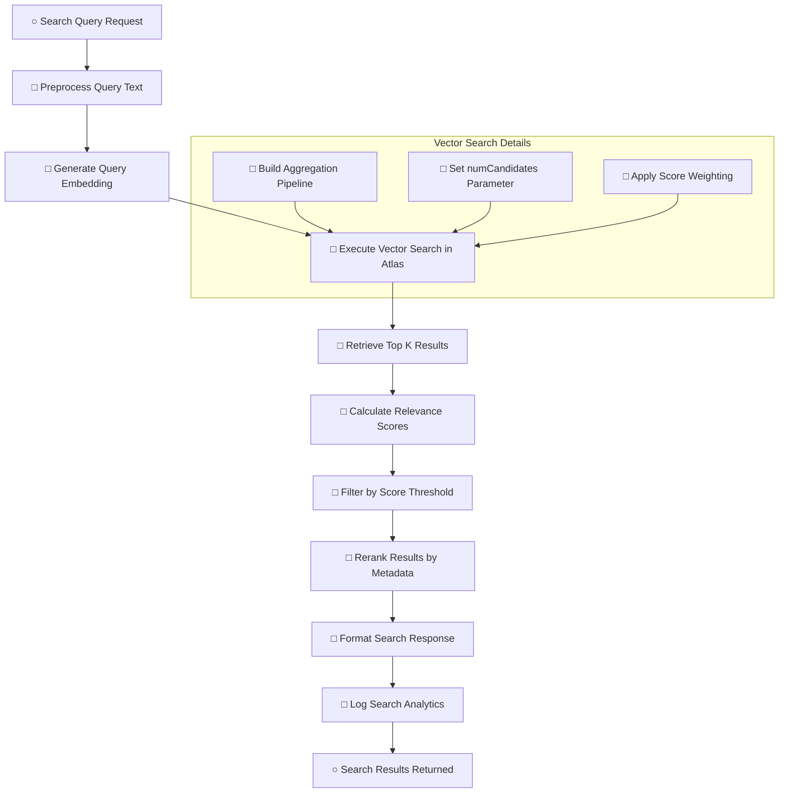
```mermaid
graph TD
    A[○ Search Query Request] --> B[□ Preprocess Query Text]
    B --> C[□ Generate Query Embedding]
    C --> D[□ Execute Vector Search in Atlas]
    D --> E[□ Retrieve Top K Results]
    E --> F[□ Calculate Relevance Scores]
    F --> G[□ Filter by Score Threshold]
    G --> H[□ Rerank Results by Metadata]
    H --> I[□ Format Search Response]
    I --> J[□ Log Search Analytics]
    J --> K[○ Search Results Returned]

    subgraph "Vector Search Details"
        D1[□ Build Aggregation Pipeline] --> D
        D2[□ Set numCandidates Parameter] --> D
        D3[□ Apply Score Weighting] --> D
    end
```

### 5.3 Batch Embedding Processing Flow

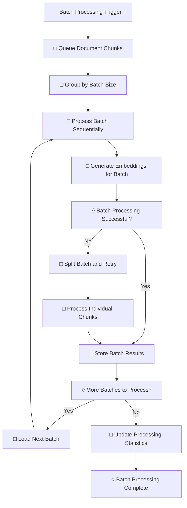
```mermaid
graph TD
    A[○ Batch Processing Trigger] --> B[□ Queue Document Chunks]
    B --> C[□ Group by Batch Size]
    C --> D[□ Process Batch Sequentially]
    D --> E[□ Generate Embeddings for Batch]
    E --> F[◊ Batch Processing Successful?]
    F -->|No| G[□ Split Batch and Retry]
    F -->|Yes| H[□ Store Batch Results]
    G --> I[□ Process Individual Chunks]
    I --> H
    H --> J[◊ More Batches to Process?]
    J -->|Yes| K[□ Load Next Batch]
    J -->|No| L[□ Update Processing Statistics]
    K --> D
    L --> M[○ Batch Processing Complete]
```

---

## 6. EVENT BUS COMMUNICATION FLOW

### 6.1 Event Publishing Flow

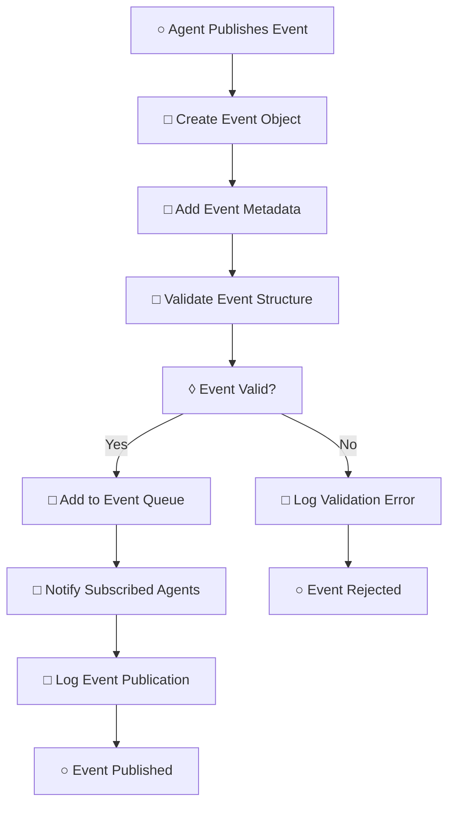
```mermaid
graph TD
    A[○ Agent Publishes Event] --> B[□ Create Event Object]
    B --> C[□ Add Event Metadata]
    C --> D[□ Validate Event Structure]
    D --> E[◊ Event Valid?]
    E -->|No| F[□ Log Validation Error]
    E -->|Yes| G[□ Add to Event Queue]
    G --> H[□ Notify Subscribed Agents]
    H --> I[□ Log Event Publication]
    I --> J[○ Event Published]
    F --> K[○ Event Rejected]
```

### 6.2 Event Subscription Flow

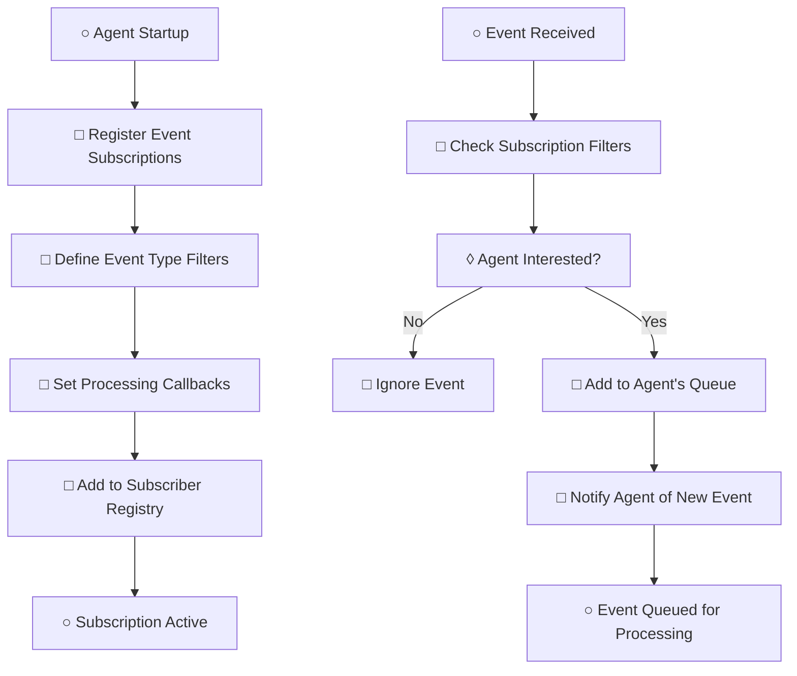
```mermaid
graph TD
    A[○ Agent Startup] --> B[□ Register Event Subscriptions]
    B --> C[□ Define Event Type Filters]
    C --> D[□ Set Processing Callbacks]
    D --> E[□ Add to Subscriber Registry]
    E --> F[○ Subscription Active]

    G[○ Event Received] --> H[□ Check Subscription Filters]
    H --> I[◊ Agent Interested?]
    I -->|No| J[□ Ignore Event]
    I -->|Yes| K[□ Add to Agent's Queue]
    K --> L[□ Notify Agent of New Event]
    L --> M[○ Event Queued for Processing]
```

### 6.3 Event Processing Flow

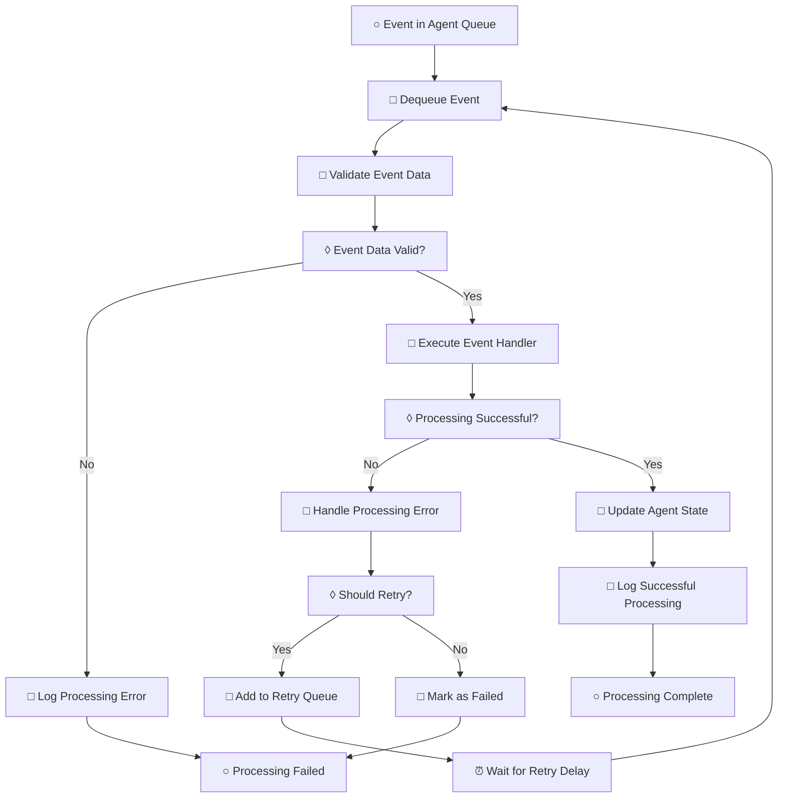
```mermaid
graph TD
    A[○ Event in Agent Queue] --> B[□ Dequeue Event]
    B --> C[□ Validate Event Data]
    C --> D[◊ Event Data Valid?]
    D -->|No| E[□ Log Processing Error]
    D -->|Yes| F[□ Execute Event Handler]
    F --> G[◊ Processing Successful?]
    G -->|No| H[□ Handle Processing Error]
    G -->|Yes| I[□ Update Agent State]
    H --> J[◊ Should Retry?]
    J -->|Yes| K[□ Add to Retry Queue]
    J -->|No| L[□ Mark as Failed]
    I --> M[□ Log Successful Processing]
    K --> N[⏰ Wait for Retry Delay]
    N --> B
    L --> O[○ Processing Failed]
    M --> P[○ Processing Complete]
    E --> O
```

---

## 7. DATA SYNCHRONIZATION FLOW

### 7.1 Local to MongoDB Sync Flow

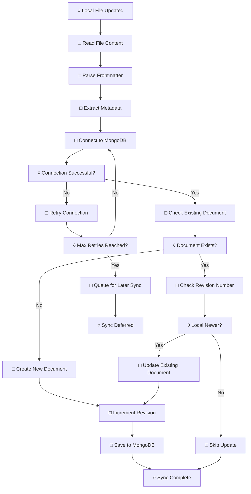
```mermaid
graph TD
    A[○ Local File Updated] --> B[□ Read File Content]
    B --> C[□ Parse Frontmatter]
    C --> D[□ Extract Metadata]
    D --> E[□ Connect to MongoDB]
    E --> F[◊ Connection Successful?]
    F -->|No| G[□ Retry Connection]
    F -->|Yes| H[□ Check Existing Document]
    G --> I[◊ Max Retries Reached?]
    I -->|Yes| J[□ Queue for Later Sync]
    I -->|No| E
    H --> K[◊ Document Exists?]
    K -->|No| L[□ Create New Document]
    K -->|Yes| M[□ Check Revision Number]
    M --> N[◊ Local Newer?]
    N -->|No| O[□ Skip Update]
    N -->|Yes| P[□ Update Existing Document]
    L --> Q[□ Increment Revision]
    P --> Q
    Q --> R[□ Save to MongoDB]
    R --> S[○ Sync Complete]
    O --> S
    J --> T[○ Sync Deferred]
```

### 7.2 MongoDB to Atlas Vector Sync Flow

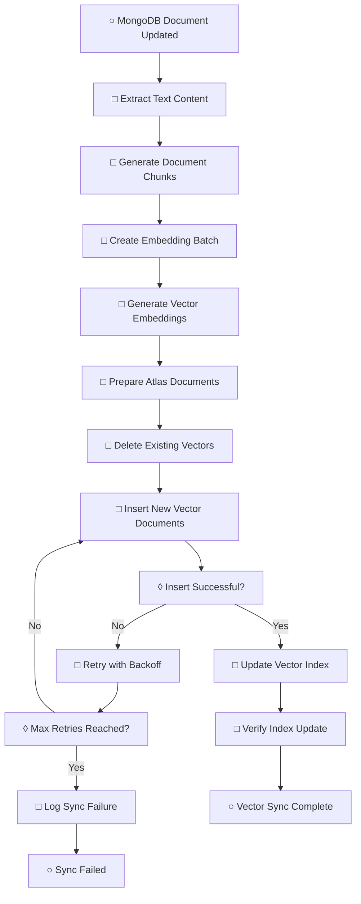
```mermaid
graph TD
    A[○ MongoDB Document Updated] --> B[□ Extract Text Content]
    B --> C[□ Generate Document Chunks]
    C --> D[□ Create Embedding Batch]
    D --> E[□ Generate Vector Embeddings]
    E --> F[□ Prepare Atlas Documents]
    F --> G[□ Delete Existing Vectors]
    G --> H[□ Insert New Vector Documents]
    H --> I[◊ Insert Successful?]
    I -->|No| J[□ Retry with Backoff]
    I -->|Yes| K[□ Update Vector Index]
    J --> L[◊ Max Retries Reached?]
    L -->|Yes| M[□ Log Sync Failure]
    L -->|No| H
    K --> N[□ Verify Index Update]
    N --> O[○ Vector Sync Complete]
    M --> P[○ Sync Failed]
```

### 7.3 Bidirectional Sync Conflict Resolution Flow

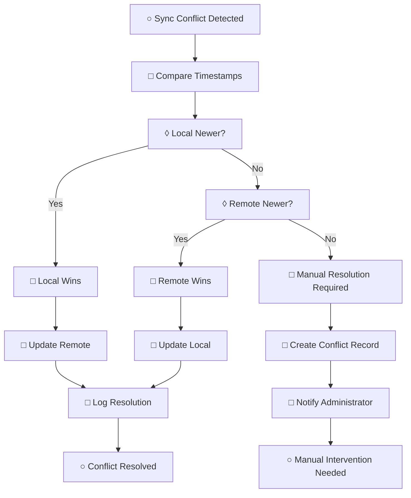
```mermaid
graph TD
    A[○ Sync Conflict Detected] --> B[□ Compare Timestamps]
    B --> C[◊ Local Newer?]
    C -->|Yes| D[□ Local Wins]
    C -->|No| E[◊ Remote Newer?]
    E -->|Yes| F[□ Remote Wins]
    E -->|No| G[□ Manual Resolution Required]
    D --> H[□ Update Remote]
    F --> I[□ Update Local]
    G --> J[□ Create Conflict Record]
    H --> K[□ Log Resolution]
    I --> K
    J --> L[□ Notify Administrator]
    K --> M[○ Conflict Resolved]
    L --> N[○ Manual Intervention Needed]
```

---

## 8. ERROR HANDLING AND RECOVERY FLOWS

### 8.1 Agent Failure Recovery Flow

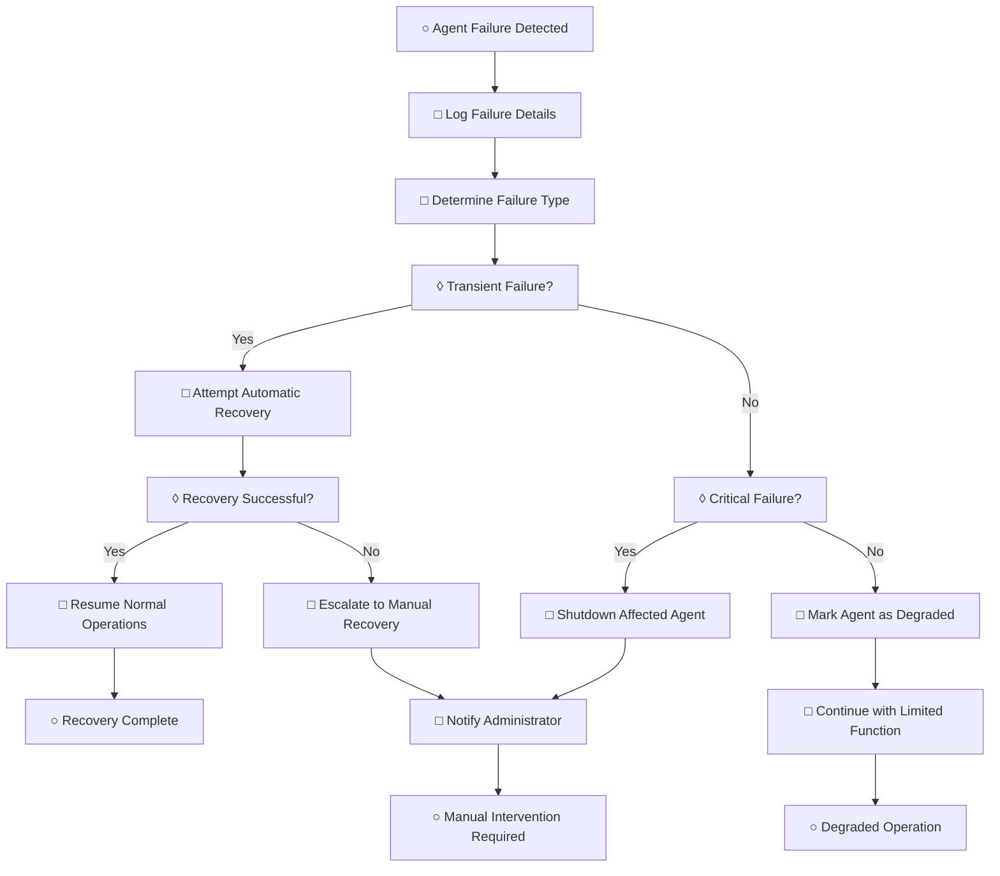
```mermaid
graph TD
    A[○ Agent Failure Detected] --> B[□ Log Failure Details]
    B --> C[□ Determine Failure Type]
    C --> D[◊ Transient Failure?]
    D -->|Yes| E[□ Attempt Automatic Recovery]
    D -->|No| F[◊ Critical Failure?]
    E --> G[◊ Recovery Successful?]
    G -->|Yes| H[□ Resume Normal Operations]
    G -->|No| I[□ Escalate to Manual Recovery]
    F -->|Yes| J[□ Shutdown Affected Agent]
    F -->|No| K[□ Mark Agent as Degraded]
    J --> L[□ Notify Administrator]
    K --> M[□ Continue with Limited Function]
    I --> L
    H --> N[○ Recovery Complete]
    L --> O[○ Manual Intervention Required]
    M --> P[○ Degraded Operation]
```

### 8.2 External Service Failure Flow

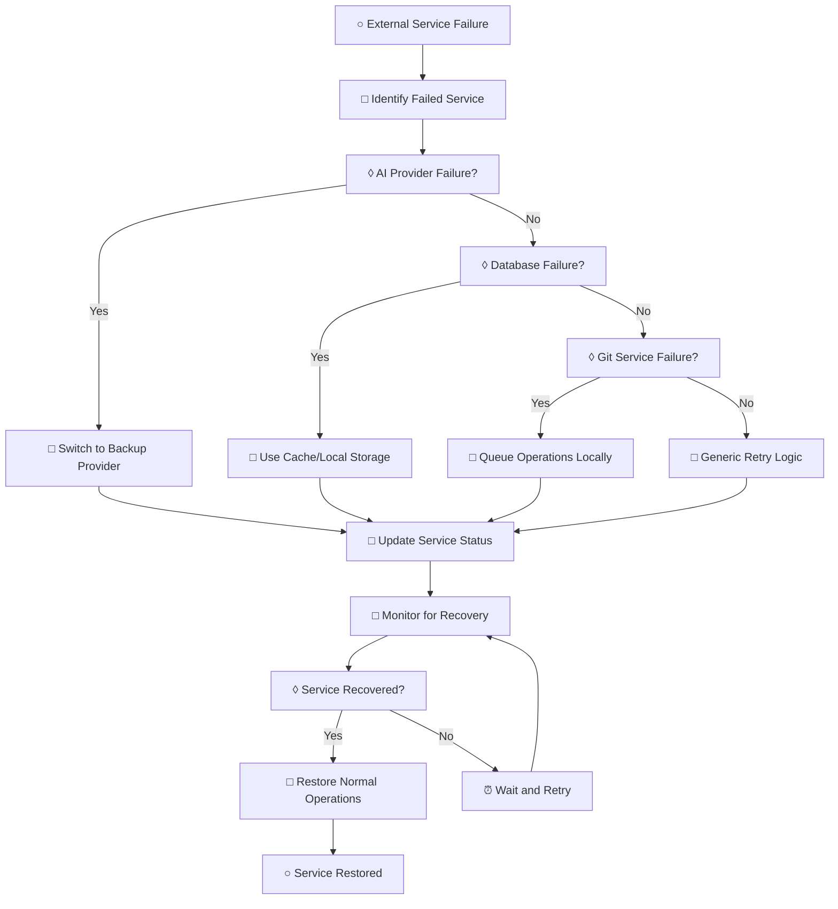
```mermaid
graph TD
    A[○ External Service Failure] --> B[□ Identify Failed Service]
    B --> C[◊ AI Provider Failure?]
    C -->|Yes| D[□ Switch to Backup Provider]
    C -->|No| E[◊ Database Failure?]
    E -->|Yes| F[□ Use Cache/Local Storage]
    E -->|No| G[◊ Git Service Failure?]
    G -->|Yes| H[□ Queue Operations Locally]
    G -->|No| I[□ Generic Retry Logic]
    D --> J[□ Update Service Status]
    F --> J
    H --> J
    I --> J
    J --> K[□ Monitor for Recovery]
    K --> L[◊ Service Recovered?]
    L -->|Yes| M[□ Restore Normal Operations]
    L -->|No| N[⏰ Wait and Retry]
    N --> K
    M --> O[○ Service Restored]
```

### 8.3 Data Corruption Recovery Flow

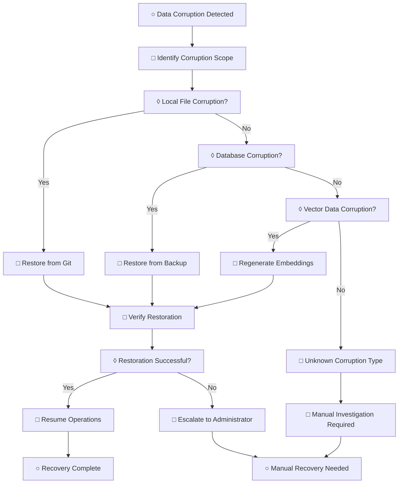
```mermaid
graph TD
    A[○ Data Corruption Detected] --> B[□ Identify Corruption Scope]
    B --> C[◊ Local File Corruption?]
    C -->|Yes| D[□ Restore from Git]
    C -->|No| E[◊ Database Corruption?]
    E -->|Yes| F[□ Restore from Backup]
    E -->|No| G[◊ Vector Data Corruption?]
    G -->|Yes| H[□ Regenerate Embeddings]
    G -->|No| I[□ Unknown Corruption Type]
    D --> J[□ Verify Restoration]
    F --> J
    H --> J
    I --> K[□ Manual Investigation Required]
    J --> L[◊ Restoration Successful?]
    L -->|Yes| M[□ Resume Operations]
    L -->|No| N[□ Escalate to Administrator]
    M --> O[○ Recovery Complete]
    N --> P[○ Manual Recovery Needed]
    K --> P
```

---

## 9. PERFORMANCE OPTIMIZATION FLOWS

### 9.1 Batch Processing Optimization Flow

```mermaid
graph TD
    A[○ Processing Queue Build-up] --> B[□ Analyze Queue Depth]
    B --> C[◊ Queue Depth > Threshold?]
    C -->|No| D[□ Continue Normal Processing]
    C -->|Yes| E[□ Activate Batch Mode]
    E --> F[□ Group Similar Operations]
    F --> G[□ Increase Batch Size]
    G --> H[□ Process Batches in Parallel]
    H --> I[□ Monitor Performance Metrics]
    I --> J[◊ Performance Improved?]
    J -->|Yes| K[□ Maintain Batch Mode]
    J -->|No| L[□ Adjust Batch Parameters]
    L --> G
    K --> M[□ Monitor Queue Depth]
    M --> N[◊ Queue Depth Normal?]
    N -->|Yes| O[□ Return to Normal Mode]
    N -->|No| K
    O --> P[○ Optimization Complete]
    D --> P
```

### 9.2 Caching Strategy Flow

```mermaid
graph TD
    A[○ Data Request] --> B[□ Check Cache]
    B --> C[◊ Cache Hit?]
    C -->|Yes| D[□ Validate Cache Age]
    C -->|No| E[□ Fetch from Source]
    D --> F[◊ Cache Valid?]
    F -->|Yes| G[□ Return Cached Data]
    F -->|No| H[□ Invalidate Cache Entry]
    H --> E
    E --> I[□ Store in Cache]
    I --> J[□ Return Fresh Data]
    G --> K[○ Request Fulfilled]
    J --> K

    subgraph "Cache Management"
        L[⏰ Cache Cleanup Timer] --> M[□ Remove Expired Entries]
        M --> N[□ Compact Cache Storage]
        N --> O[□ Update Cache Statistics]
    end
```

### 9.3 Load Balancing Flow

```mermaid
graph TD
    A[○ High Load Detected] --> B[□ Analyze Current Load]
    B --> C[□ Identify Bottleneck Agent]
    C --> D[◊ Agent Overloaded?]
    D -->|No| E[□ Optimize Current Resources]
    D -->|Yes| F[□ Check Resource Availability]
    F --> G[◊ Resources Available?]
    G -->|No| H[□ Queue Excess Load]
    G -->|Yes| I[□ Spawn Additional Agent Instance]
    I --> J[□ Distribute Load]
    J --> K[□ Monitor Performance Impact]
    K --> L[◊ Load Balanced?]
    L -->|Yes| M[□ Maintain Current Configuration]
    L -->|No| N[□ Adjust Load Distribution]
    N --> J
    M --> O[○ Load Balancing Active]
    H --> P[○ Load Queued]
    E --> Q[○ Optimization Applied]
```

---

## 10. MONITORING AND ALERTING FLOWS

### 10.1 Health Check Flow

```mermaid
graph TD
    A[⏰ Health Check Timer] --> B[□ Check All Agent Status]
    B --> C[□ Test External Connections]
    C --> D[□ Verify Resource Usage]
    D --> E[□ Check Queue Depths]
    E --> F[□ Validate Data Integrity]
    F --> G[□ Aggregate Health Metrics]
    G --> H[◊ System Healthy?]
    H -->|Yes| I[□ Update Health Status]
    H -->|No| J[□ Identify Issues]
    J --> K[□ Categorize Issue Severity]
    K --> L[◊ Critical Issue?]
    L -->|Yes| M[□ Trigger Immediate Alert]
    L -->|No| N[□ Log Warning]
    I --> O[□ Update Dashboard]
    M --> P[□ Execute Recovery Procedures]
    N --> O
    O --> Q[○ Health Check Complete]
    P --> R[○ Recovery Initiated]
```

### 10.2 Performance Monitoring Flow

```mermaid
graph TD
    A[○ Performance Event] --> B[□ Capture Metrics]
    B --> C[□ Calculate Performance Indicators]
    C --> D[□ Compare Against Baselines]
    D --> E[◊ Performance Degraded?]
    E -->|No| F[□ Update Normal Metrics]
    E -->|Yes| G[□ Analyze Degradation Cause]
    G --> H[◊ Temporary Spike?]
    H -->|Yes| I[□ Log Performance Event]
    H -->|No| J[□ Identify Trend Pattern]
    J --> K[□ Predict Future Impact]
    K --> L[□ Generate Performance Alert]
    L --> M[□ Recommend Optimization]
    F --> N[□ Store Metrics]
    I --> N
    M --> N
    N --> O[○ Metrics Stored]
```

### 10.3 Alert Escalation Flow

```mermaid
graph TD
    A[○ Alert Triggered] --> B[□ Determine Alert Severity]
    B --> C[◊ Critical Alert?]
    C -->|Yes| D[□ Immediate Notification]
    C -->|No| E[◊ Warning Alert?]
    E -->|Yes| F[□ Standard Notification]
    E -->|No| G[□ Info Notification]
    D --> H[□ Start Escalation Timer]
    F --> I[□ Monitor for Resolution]
    G --> J[□ Log Information Event]
    H --> K[⏰ Escalation Timer Expires]
    K --> L[◊ Alert Acknowledged?]
    L -->|No| M[□ Escalate to Next Level]
    L -->|Yes| N[□ Monitor Resolution Progress]
    M --> O[□ Notify Higher Authority]
    O --> P[□ Restart Escalation Timer]
    P --> K
    N --> Q[◊ Issue Resolved?]
    Q -->|Yes| R[□ Clear Alert]
    Q -->|No| S[⏰ Check Resolution Progress]
    S --> Q
    R --> T[○ Alert Resolved]
    I --> U[○ Alert Monitored]
    J --> V[○ Alert Logged]
```

---

## 11. DEPLOYMENT AND MAINTENANCE FLOWS

### 11.1 Automated Deployment Flow

```mermaid
graph TD
    A[○ Code Commit] --> B[□ Trigger CI/CD Pipeline]
    B --> C[□ Run Automated Tests]
    C --> D[◊ Tests Pass?]
    D -->|No| E[□ Notify Developer]
    D -->|Yes| F[□ Build Application]
    F --> G[□ Security Scan]
    G --> H[◊ Security Clear?]
    H -->|No| I[□ Block Deployment]
    H -->|Yes| J[□ Deploy to Staging]
    J --> K[□ Run Integration Tests]
    K --> L[◊ Integration Tests Pass?]
    L -->|No| M[□ Rollback Staging]
    L -->|Yes| N[□ Deploy to Production]
    N --> O[□ Health Check Production]
    O --> P[◊ Production Healthy?]
    P -->|No| Q[□ Automatic Rollback]
    P -->|Yes| R[□ Complete Deployment]
    R --> S[○ Deployment Successful]
    E --> T[○ Deployment Failed]
    I --> T
    M --> T
    Q --> U[○ Rollback Complete]
```

### 11.2 System Maintenance Flow

```mermaid
graph TD
    A[⏰ Maintenance Schedule] --> B[□ Pre-maintenance Health Check]
    B --> C[◊ System Stable?]
    C -->|No| D[□ Defer Maintenance]
    C -->|Yes| E[□ Create System Backup]
    E --> F[□ Put System in Maintenance Mode]
    F --> G[□ Execute Maintenance Tasks]
    G --> H[□ Database Cleanup]
    H --> I[□ Log Rotation]
    I --> J[□ Cache Cleanup]
    J --> K[□ Update Dependencies]
    K --> L[□ Restart Services]
    L --> M[□ Post-maintenance Health Check]
    M --> N[◊ All Systems Healthy?]
    N -->|No| O[□ Restore from Backup]
    N -->|Yes| P[□ Exit Maintenance Mode]
    O --> Q[□ Investigate Issues]
    P --> R[□ Update Maintenance Log]
    R --> S[○ Maintenance Complete]
    Q --> T[○ Maintenance Failed]
    D --> U[○ Maintenance Deferred]
```

### 11.3 Backup and Recovery Flow

```mermaid
graph TD
    A[⏰ Backup Schedule] --> B[□ Check System Status]
    B --> C[□ Create Data Snapshot]
    C --> D[□ Backup MongoDB Collections]
    D --> E[□ Backup Vector Embeddings]
    E --> F[□ Backup Configuration Files]
    F --> G[□ Backup Application Code]
    G --> H[□ Compress Backup Archives]
    H --> I[□ Upload to Cloud Storage]
    I --> J[□ Verify Backup Integrity]
    J --> K[◊ Backup Valid?]
    K -->|No| L[□ Retry Backup Process]
    K -->|Yes| M[□ Update Backup Catalog]
    M --> N[□ Cleanup Old Backups]
    N --> O[○ Backup Complete]
    L --> P[◊ Max Retries Reached?]
    P -->|Yes| Q[□ Alert Administrator]
    P -->|No| C
    Q --> R[○ Backup Failed]

    subgraph "Recovery Process"
        S[○ Recovery Requested] --> T[□ Select Backup Version]
        T --> U[□ Validate Backup Integrity]
        U --> V[□ Restore Data Components]
        V --> W[□ Verify System Functionality]
        W --> X[○ Recovery Complete]
    end
```

---

**Document Control**  
**Author**: GitHub Copilot  
**Reviewers**: TBD  
**Last Updated**: December 13, 2025  
**Version**: 1.0
