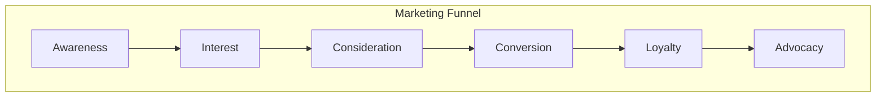

# Comprehensive Marketing Strategy for ClientPass

This document provides a detailed marketing strategy designed to maximize the adoption and growth of the ClientPass application.

## 1. Deep Dive into Target Audiences

A successful marketing strategy starts with a deep understanding of our target audiences. We have identified four key segments:

- **The Independent Stylist (Pro):**
    - **Demographics:** Aged 25-45, tech-savvy, active on social media (especially Instagram and TikTok). They are either renting a booth, working on commission, or have their own small studio.
    - **Pain Points:** Irregular income, difficulty finding new clients, administrative overhead (booking, payments, marketing), and the high cost of professional tools.
    - **Goals:** To build a loyal clientele, increase their income, and focus on their craft rather than on administrative tasks.

- **The Salon/Suite Owner (Suite):**
    - **Demographics:** Aged 35-60, business-minded, may own one or multiple locations. They are looking for ways to optimize their business and increase profitability.
    - **Pain Points:** Under-utilized chairs/suites, high turnover of stylists, time-consuming management tasks, and the need to create additional revenue streams.
    - **Goals:** To maximize occupancy, streamline operations, create a thriving community of stylists, and increase the overall profitability of their business.

- **The Modern Client:**
    - **Demographics:** Aged 18-50, digitally native, values convenience and social proof. They use apps for everything from ordering food to booking travel.
    - **Pain Points:** Difficulty finding and booking appointments with trusted stylists, lack of a centralized platform for managing their beauty regimen, and the desire to be rewarded for their loyalty.
    - **Goals:** To easily discover and book talented stylists, manage their appointments seamlessly, and feel valued as a customer.

- **The Beauty Influencer (Affiliate):**
    - **Demographics:** Varies widely, but they have a dedicated following on social media and are seen as experts in the beauty industry.
    - **Pain Points:** The need to monetize their content in an authentic way, and the desire to offer real value to their audience.
    - **Goals:** To partner with brands that align with their values, earn a sustainable income from their content, and provide their followers with valuable recommendations.

## 2. Crafting a Compelling Value Proposition

Our messaging needs to resonate with the specific goals and pain points of each audience segment.

- **For Stylists:** "Stop worrying about the business side of things. ClientPass is your all-in-one solution to fill your chair, manage your bookings, and grow your income, so you can focus on what you do best: creating beautiful hair."
- **For Salon/Suite Owners:** "Transform your salon into a thriving, fully-occupied business. ClientPass helps you find and retain top talent, streamline your management tasks, and unlock new revenue streams. It's the business partner you've been looking for."
- **For Clients:** "Your next great hair day is just a tap away. Discover and book the best stylists in your city, manage your appointments with ease, and get rewarded for sharing the love with your friends."
- **For Affiliates:** "Turn your passion for beauty into a paycheck. Partner with ClientPass to promote top-quality products to your audience and earn a commission on every sale. It's the easiest way to monetize your influence."

## 3. A Multi-Channel Marketing Approach

We will use a combination of online and offline channels to reach our target audiences.

```mermaid
graph TD
    A[Marketing Channels] --> B[Online];
    A --> C[Offline];

    B --> B1[Social Media (Instagram, TikTok, Facebook)];
    B --> B2[Content Marketing (Blog, YouTube)];
    B --> B3[Email Marketing];
    B_B4[...]
    B --> B_B4[Paid Advertising (Social & Search)];

    C --> C1[Industry Events & Trade Shows];
    C --> C2[Partnerships with Beauty Schools];
    C --> C3[Local Meetups & Workshops];
```

- **Social Media:** This is our most important channel. We will create a content calendar and post a mix of educational, inspirational, and promotional content. We will also run targeted ad campaigns to reach specific audience segments.
- **Content Marketing:** We will create a blog and a YouTube channel with high-quality content that addresses the pain points of our target audiences. This will help us to build trust and authority in the industry.
- **Email Marketing:** We will build an email list through our website and social media channels. We will use email to nurture leads, announce new features, and promote special offers.
- **Industry Events:** We will have a presence at major hair shows and beauty expos. This will give us the opportunity to connect with stylists and salon owners in person and demo the application.
- **Partnerships:** We will build relationships with beauty schools, salon suite franchises, and beauty product companies. These partnerships will help us to reach a wider audience and build credibility.

## 4. Actionable Marketing Campaigns

Here are some specific campaigns we can launch to drive adoption:

- **The "Founding 500" Campaign (Pre-Launch/Launch):**
    - **Goal:** To create a community of early adopters and generate buzz before the official launch.
    - **Tactic:** Offer an exclusive "Founding 500" membership to the first 500 stylists who sign up. This membership could include a lifetime discount, a special badge on their profile, and access to exclusive features.
    - **Promotion:** Promote the campaign through social media ads, partnerships with influencers, and a landing page on our website.

- **The "Refer-a-Stylist, Get $100" Campaign (Post-Launch):**
    - **Goal:** To accelerate user growth by incentivizing stylist-to-stylist referrals.
    - **Tactic:** Offer a $100 cash bonus to any stylist who refers another stylist who signs up and completes their first booking.
    - **Promotion:** Promote the campaign through email marketing, in-app notifications, and social media.

- **The "ClientPass University" Content Campaign (Ongoing):**
    - **Goal:** To establish ClientPass as a thought leader in the industry and attract new users through valuable content.
    - **Tactic:** Create a series of high-quality video tutorials and blog posts on topics like "How to Build a Six-Figure Clientele", "The Ultimate Guide to Instagram for Stylists", and "How to Run a Profitable Salon Suite".
    - **Promotion:** Promote the content through social media, email marketing, and SEO.

## 5. The Marketing Funnel

We can visualize our marketing efforts as a funnel that guides potential users from awareness to advocacy.



- **Awareness:** Potential users hear about ClientPass for the first time through social media, a blog post, or an ad.
- **Interest:** They visit our website or social media profiles to learn more.
- **Consideration:** They compare ClientPass to other solutions and read reviews.
- **Conversion:** They sign up for a free trial or a paid plan.
- **Loyalty:** They continue to use the application and have a positive experience.
- **Advocacy:** They become a brand advocate and refer other users to the platform.

By creating a comprehensive marketing strategy that targets the right audience with the right message through the right channels, we can maximize the adoption and success of the ClientPass application.
