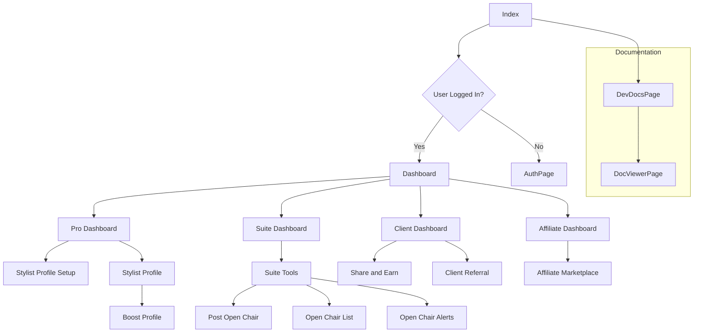

# Navigation Flowchart

This document describes the navigation flow of the application.

```mermaid
graph TD
    A[Index] --> B{User Logged In?};
    B -- Yes --> C[Dashboard];
    B -- No --> D[AuthPage];

    C --> E[Pro Dashboard];
    C --> F[Suite Dashboard];
    C --> G[Client Dashboard];
    C --> H[Affiliate Dashboard];

    H --> I[Affiliate Marketplace];

    F --> J[Suite Tools];
    J --> K[Post Open Chair];
    J --> L[Open Chair List];
    J --> M[Open Chair Alerts];

    G --> N[Share and Earn];
    G --> O[Client Referral];

    E --> P[Stylist Profile Setup];
    E --> Q[Stylist Profile];
    Q --> R[Boost Profile];

    subgraph "Documentation"
        S[DevDocsPage] --> T[DocViewerPage];
    end

    A --> S;
```
