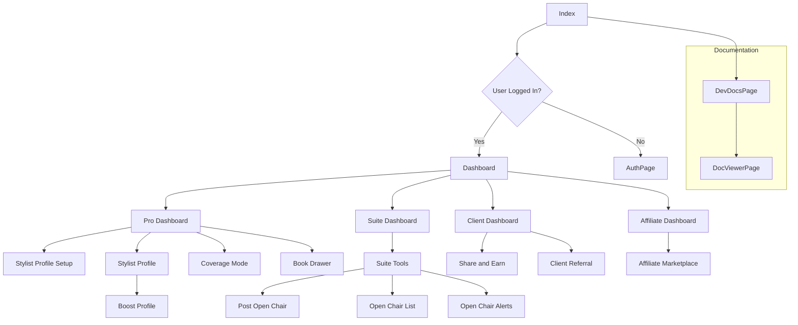

---
title: Navigation Flowchart
revision: 2.2
last_updated: November 8, 2025
---

This document describes the navigation flow of the application.


```markdown
### Recent Updates

- **Coverage Mode**: A new feature has been added to the Pro Dashboard, allowing users to access the Coverage Mode page.
- **Book Drawer**: A new component, the Book Drawer, has been integrated into the Pro Dashboard for streamlined booking management.
- **Tab Navigation**: The Dashboard now supports URL-based tab navigation, allowing users to directly access specific tabs via URL parameters.
- **UI Consistency**: UI has been updated to ensure consistency across all pages.
- **Referral Auto-Pass**: Implemented Phase 13 of the Referral Auto-Pass feature.
```