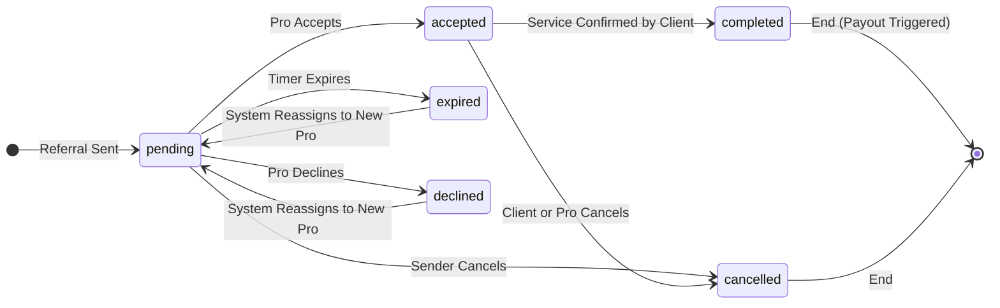
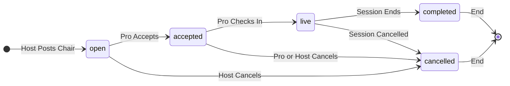
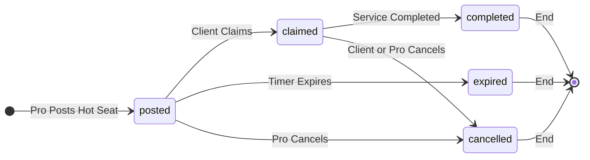
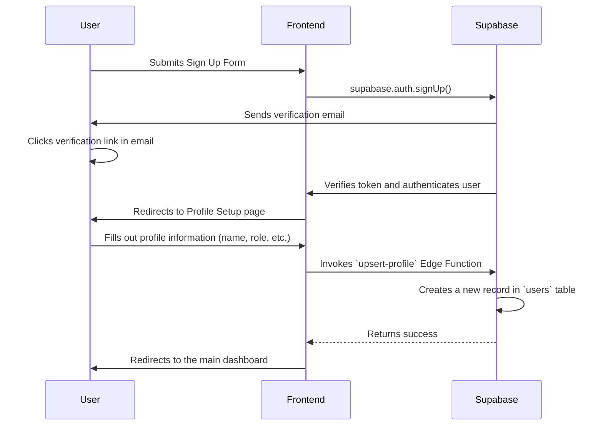

# Process Models

This document contains diagrams that model the key business processes and entity lifecycles within the ClientPass application.

---

## 1. Referral Lifecycle State Machine

This diagram illustrates the various states a `Referral` can be in, from creation to completion. It models the transitions based on user actions and system events.

### State Descriptions

- **pending**: A referral has been sent to a professional and is awaiting their response within a 10-minute window.
- **accepted**: A professional has accepted the referral and is expected to contact the client to schedule.
- **expired**: The 10-minute response timer ran out. The system will attempt to reassign the referral.
- **declined**: The professional actively declined the referral. The system will attempt to reassign.
- **cancelled**: The referral was cancelled by the sender, client, or an administrator before the service was completed.
- **completed**: The client has confirmed the service was rendered, and the payment process is initiated.

## 2. Open Chair Lifecycle State Machine

This diagram shows the states of an `open_chairs` listing.

### State Descriptions

-   **open**: The chair is listed and available for booking.
-   **accepted**: A Pro has accepted the open chair offer but has not yet started the session.
-   **live**: The Pro has checked in, and the session is in progress.
-   **completed**: The session has ended, and commissions are settled.
-   **cancelled**: The listing was cancelled by the host or the pro.

## 3. Hot Seat Lifecycle State Machine

This diagram shows the states of a `hot_seats` offer.

### State Descriptions

-   **posted**: The hot seat is available for clients to claim.
-   **claimed**: A client has claimed the hot seat.
-   **expired**: The offer has expired without being claimed.
-   **completed**: The service has been completed and paid for.
-   **cancelled**: The hot seat was cancelled by the pro or the client.

## 4. User Onboarding Flow

This sequence diagram shows the steps for a new user to get fully set up on the platform.

