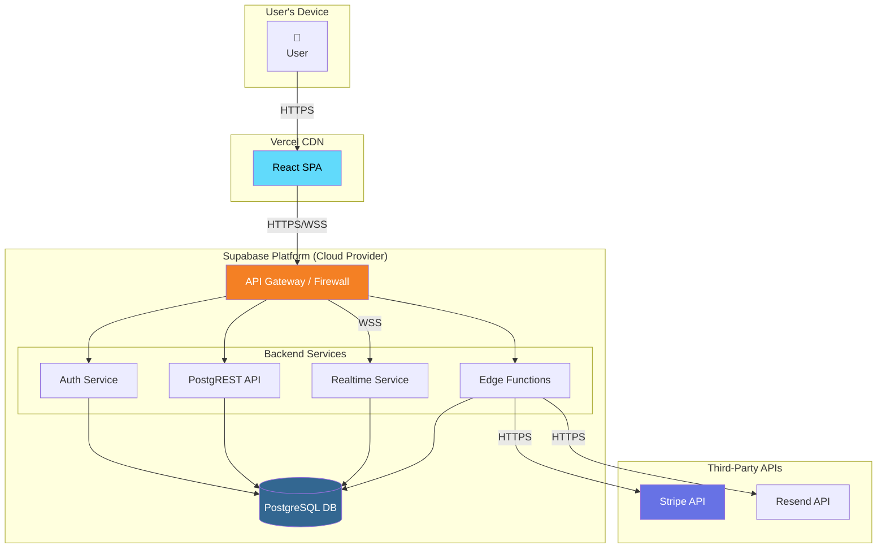
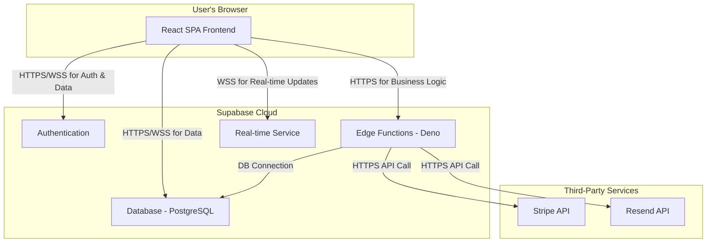
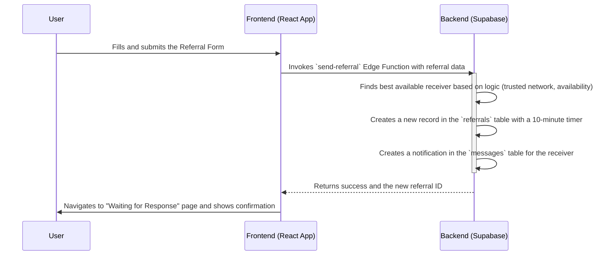
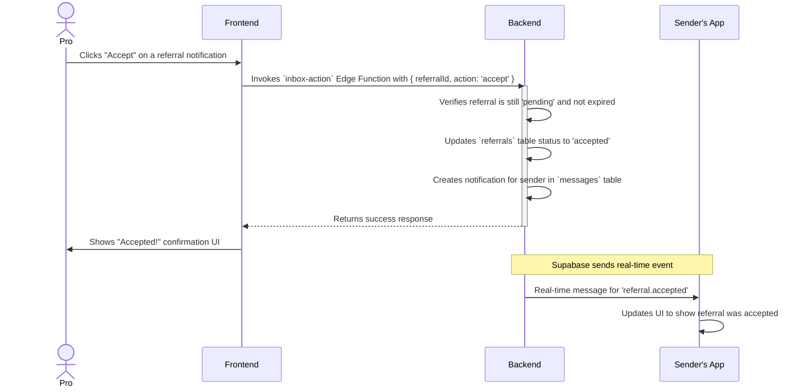
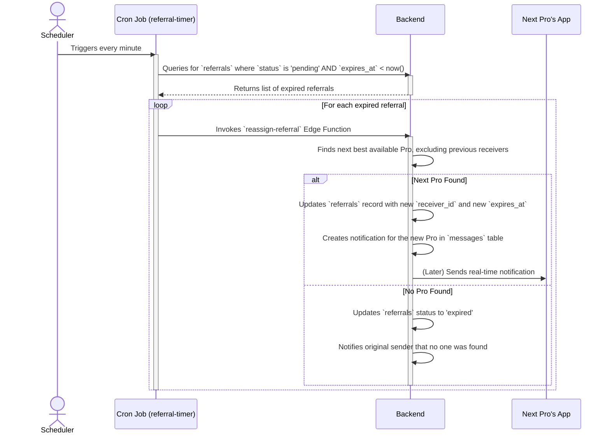
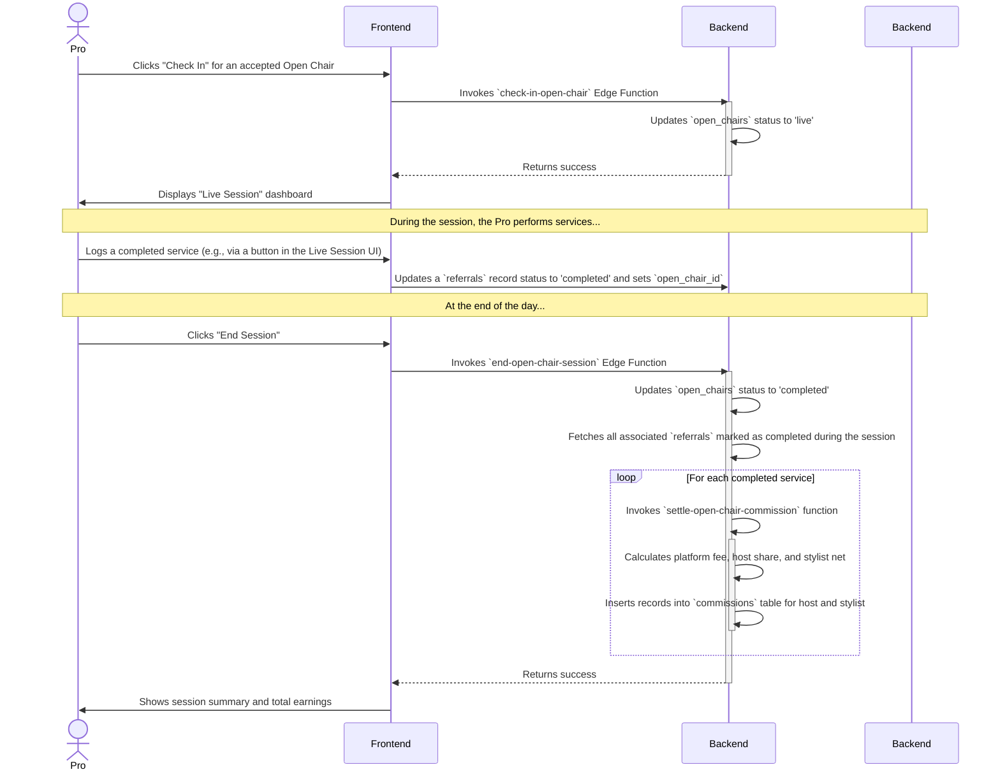
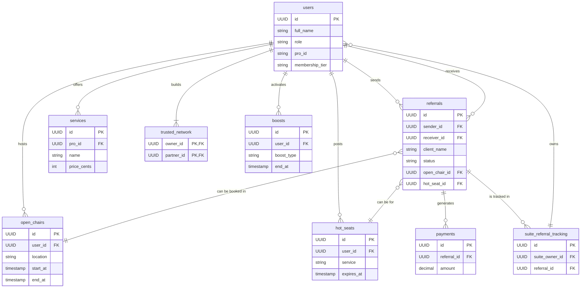

# Software Architecture Document (SAD)

## 1. Introduction

### 1.1 Purpose
This document provides a comprehensive architectural overview of the ClientPass application. It is intended for developers, architects, and technical stakeholders to understand the system's structure, components, interactions, and design principles.

### 1.2 Scope
The scope of this document covers the frontend web application, the serverless backend, the database schema, and the deployment strategy for the ClientPass platform.

### 1.3 Architectural Representation
This document uses a simplified version of the **4+1 architectural view model** to describe the system from different perspectives:
- **Logical View**: The system's functional components and their responsibilities.
- **Process View**: The system's dynamic behavior and component interactions.
- **Development View**: The organization of the source code and build system.
- **Physical (Deployment) View**: The mapping of software components to the physical infrastructure.
- **Data View**: The structure and organization of the data.

## 2. System Architecture Diagram

This diagram provides a detailed, high-level view of the entire system architecture, including network boundaries, services, and dependencies.

## 3. Logical View

This diagram illustrates the high-level logical components of the system and their primary relationships.

The system is decomposed into two main containers: the Frontend Application and the Backend Services.

### 3.1 Frontend Application (Client-Side)
- **UI Components (React)**: A collection of pages, forms, and custom components built with React, TypeScript, and shadcn-ui.
- **Routing Service (React Router)**: Manages client-side navigation and renders the appropriate page components.
- **State Management Service**: Utilizes TanStack Query for managing server state (caching, re-fetching) and React Context for global UI state like authentication.
- **API Client Service (Supabase JS Client)**: The sole interface for communicating with the backend. It handles API requests to the database and invokes Edge Functions.

### 3.2 Backend Services (Supabase)
- **Authentication Service (Supabase Auth)**: Manages user sign-up, login, and session management.
- **Database Service (PostgreSQL)**: The primary data store, with access controlled by Row Level Security (RLS) policies.
- **Business Logic Layer (Edge Functions)**: A suite of serverless functions that encapsulate core business logic (e.g., `send-referral`, `settle-open-chair-commission`).
- **Real-time Service (Supabase Realtime)**: Pushes live updates to connected clients (e.g., for referral status changes).

## 4. Process View

This view describes the sequence of interactions for key workflows in the system.

### 4.1 Send Referral Workflow

This diagram shows the process when a user sends a new referral.

### 4.2 Accepting a Referral (Happy Path)

This diagram shows the process when a stylist successfully accepts a referral notification.

### 4.3 Handling an Expired Referral

This diagram illustrates the automated backend process when a referral is not accepted in time.

### 4.4 Open Chair Session Workflow

This diagram shows the end-to-end flow of a stylist using an Open Chair, from check-in to settlement.

## 5. Development View

This view describes the organization of the source code.

- **`style-referral-ring/` (Root)**
  - **`src/`**: Contains all frontend source code.
    - **`components/`**: Reusable React components, organized by feature.
    - **`pages/`**: Top-level components for each application route.
    - **`contexts/`**: Global state providers (e.g., `AuthContext`).
    - **`integrations/`**: Supabase client setup.
  - **`supabase/`**: Contains all backend code and configuration.
    - **`functions/`**: Each sub-directory is a self-contained Edge Function.
    - **`migrations/`**: Contains SQL files that define the database schema history.
  - **`docs/`**: Contains all project documentation, including this SAD.
  - **`package.json`**: Manages all Node.js dependencies for the frontend.
  - **`vite.config.ts`**: Configuration for the Vite build tool.

## 6. Physical (Deployment) View

The application is deployed on a modern serverless infrastructure.

- **Frontend**: The static assets (HTML, CSS, JS) generated by the Vite build process are hosted on **Vercel's** global CDN. This provides fast load times for users worldwide.
- **Backend**: All backend services are hosted on **Supabase**.
  - **Database**: A managed PostgreSQL instance running in the cloud.
  - **Edge Functions**: Deployed to a globally distributed network of Deno-based runtimes, ensuring low-latency execution of backend logic.
  - **File Storage**: Supabase Storage is used for user-uploaded assets like profile photos.

## 7. Data View

The data architecture is defined by the PostgreSQL schema. The following Entity-Relationship Diagram (ERD) illustrates the relationships between the core entities of the system.

For a complete and detailed breakdown of every table and column, please refer to the **`docs/DATABASE_SCHEMA.md`** document.