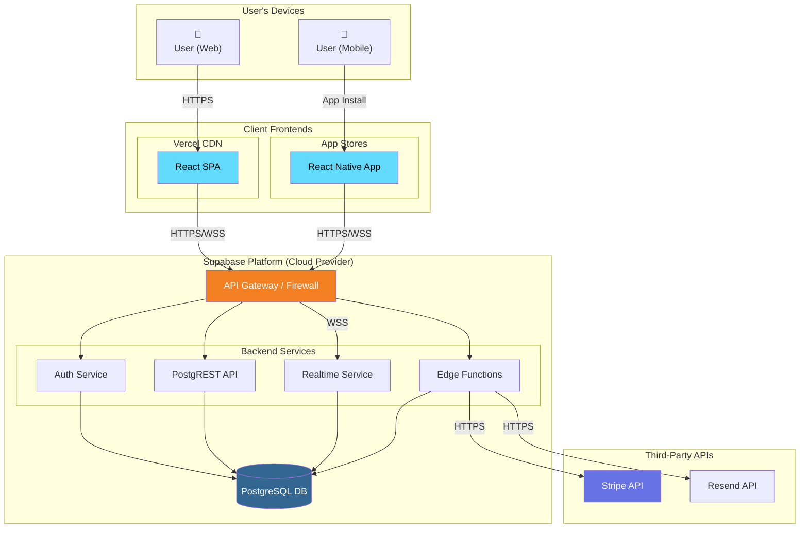
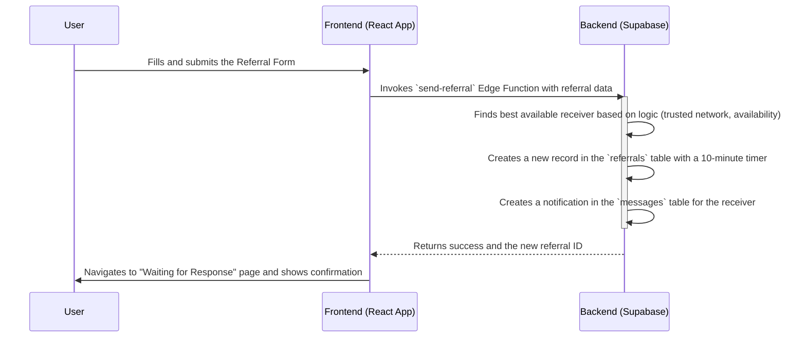
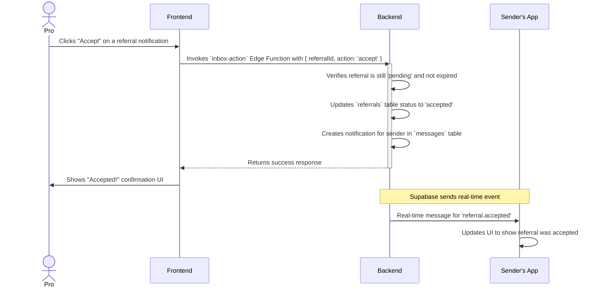
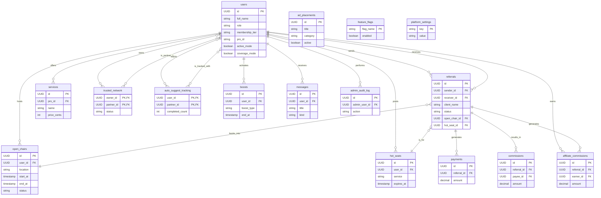

# Software Architecture Document (SAD)

## 1. Introduction

### 1.1 Purpose
This document provides a comprehensive architectural overview of the ClientPass application. It is intended for developers, architects, and technical stakeholders to understand the system's structure, components, interactions, and design principles.

### 1.2 Scope
The scope of this document covers the **ClientPass platform**, which includes a frontend web application, a native mobile application, a serverless backend, the database schema, and the deployment strategy.

### 1.3 Architectural Representation
This document uses a simplified version of the **4+1 architectural view model** to describe the system from different perspectives:
- **Logical View**: The system's functional components and their responsibilities.
- **Process View**: The system's dynamic behavior and component interactions.
- **Development View**: The organization of the source code and build system.
- **Physical (Deployment) View**: The mapping of software components to the physical infrastructure.
- **Data View**: The structure and organization of the data.

## 2. System Architecture Diagram

This diagram provides a detailed, high-level view of the entire system architecture, including network boundaries, services, and dependencies for both web and mobile clients.



## 3. Logical View

This diagram illustrates the high-level logical components of the system and their primary relationships.

```mermaid
graph TD
    subgraph "Client Devices"
        A[Web Frontend (React)]
        B[Mobile Frontend (React Native)]
    end

    subgraph "Supabase Cloud"
        C[Authentication]
        D[Database - PostgreSQL]
        E[Edge Functions - Deno]
        F[Real-time Service]
    end

    subgraph "Third-Party Services"
        G[Stripe API]
        H[Resend API]
    end

    A -- "API Calls" --> C
    A -- "API Calls" --> D
    A -- "API Calls" --> E
    A -- "API Calls" --> F
    B -- "API Calls" --> C
    B -- "API Calls" --> D
    B -- "API Calls" --> E
    B -- "API Calls" --> F

    E -- "DB Connection" --> D
    E -- "HTTPS API Call" --> G
    E -- "HTTPS API Call" --> H
```

The system is decomposed into three main containers: the Web Frontend, the Mobile Frontend, and the shared Backend Services.

### 3.1 Frontend Applications (Client-Side)

#### 3.1.1 Web Application
- **UI Components (React)**: Built with React, TypeScript, and **shadcn-ui**.
- **Routing Service (React Router)**: Manages client-side navigation.
- **State Management Service**: Uses **Zustand** and **TanStack Query**.

#### 3.1.2 Mobile Application
- **UI Components (React Native)**: Built with React Native and **React Native Paper**.
- **Routing Service (Expo Router)**: Manages native navigation.
- **State Management Service**: Uses **React Context** for global state.

### 3.2 Backend Services (Supabase)
- **Authentication Service (Supabase Auth)**: Manages user sign-up, login, and sessions for both clients.
- **Database Service (PostgreSQL)**: The primary data store, with access controlled by Row Level Security (RLS) policies.
- **Business Logic Layer (Edge Functions)**: A suite of serverless functions that encapsulate core business logic, callable from both clients.
- **Real-time Service (Supabase Realtime)**: Pushes live updates to connected clients.

## 4. Process View

This view describes the sequence of interactions for key workflows. The processes are client-agnostic, as both the web and mobile apps interact with the same backend services.

(The existing sequence diagrams for Send Referral, Accept Referral, etc., remain valid as they describe the interaction with the backend, which is shared.)

### 4.1 Send Referral Workflow



### 4.2 Accepting a Referral (Happy Path)



## 5. Development View

This view describes the organization of the source code across the two main projects.

- **`style-referral-ring/` (Web App)**
  - **`src/`**: Contains all web frontend source code (React, shadcn-ui).
- **`clientpass-react-native/` (Mobile App)**
  - **`app/`**: Contains all mobile app screens and routing logic (Expo Router).
  - **`components/`**: Contains reusable React Native components.
- **`supabase/` (Shared Backend)**
  - **`functions/`**: Self-contained Edge Functions callable by both clients.
  - **`migrations/`**: SQL files defining the shared database schema.

## 6. Physical (Deployment) View

The application is deployed on a modern serverless infrastructure.

- **Web Frontend**: The static assets are hosted on **Vercel's** global CDN.
- **Mobile Frontend**: The application is built and deployed to the **Apple App Store** and **Google Play Store** via Expo Application Services (EAS).
- **Backend**: All backend services are hosted on **Supabase**, serving both web and mobile clients.

## 7. Data View

The data architecture is defined by the shared PostgreSQL schema. The ERD remains the same as it represents the single source of truth for both applications.



For a complete and detailed breakdown of every table and column, please refer to the **`docs/DATABASE_SCHEMA.md`** document.
