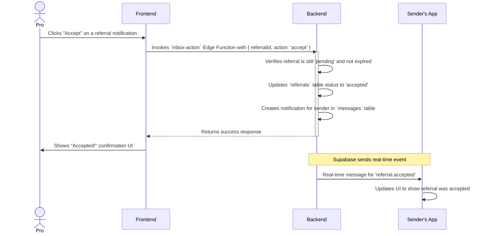
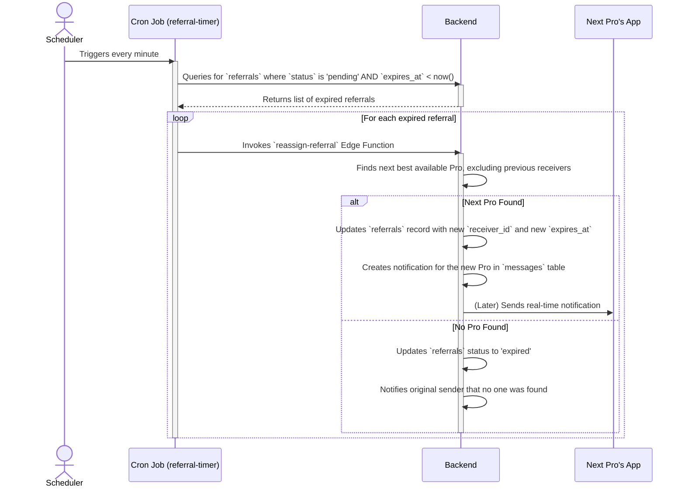
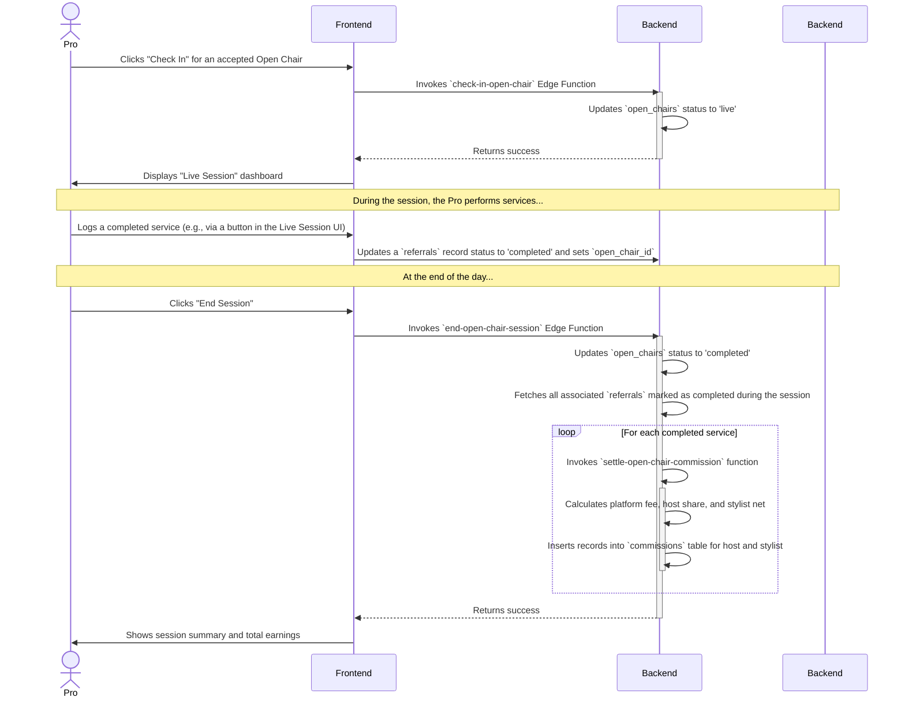

# Sequence Diagrams

This document provides detailed sequence diagrams for key workflows within the ClientPass application. These diagrams illustrate the dynamic interactions between different parts of the system.

---

## 1. Accepting a Referral (Happy Path)

This diagram shows the process when a stylist successfully accepts a referral notification within the time limit.

---

## 2. Handling an Expired Referral

This diagram illustrates the automated backend process when a referral is not accepted in time.

---

## 3. Open Chair Session Workflow

This diagram shows the end-to-end flow of a stylist using an Open Chair, from check-in to settlement.

