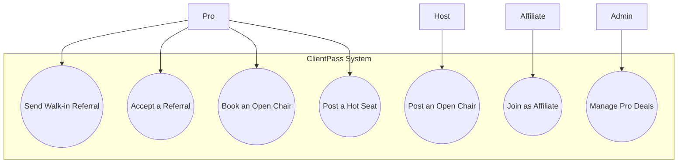
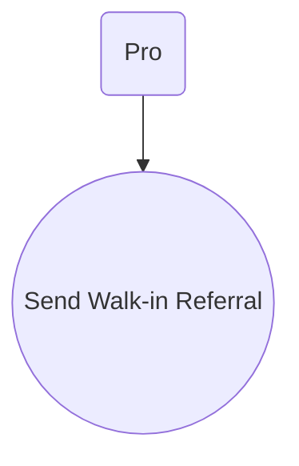
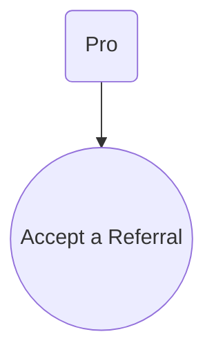
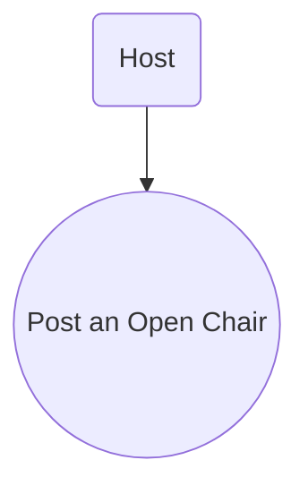
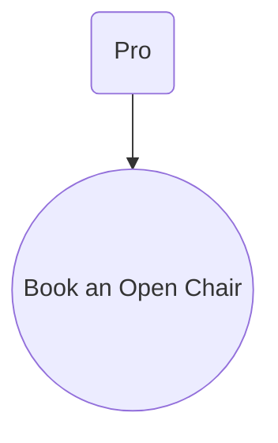
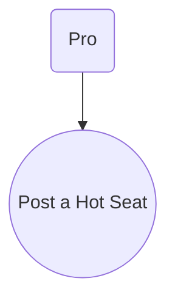

<!-- TODO: Fix Mermaid diagram rendering issue in Section 4. The diagrams are not rendering correctly, and this is a known issue. -->

# Use Case Models

## 1. Introduction

This document describes the primary use cases for the ClientPass system, detailing the interactions between users (actors) and the system to achieve specific goals.

## 2. Actors

- **Pro (Stylist/Barber)**: A professional providing services.
- **Host**: A Pro or Suite Owner who lists their chair/space for use.
- **Client**: A person receiving a service, referred via the platform.
- **Affiliate**: A user who recruits other Pros to the platform.
- **Admin**: A system administrator.

## 3. Use Case Diagram

## 4. Use Case Descriptions

### UC-01: Send a Walk-in Referral

**Use Case ID**: UC-01

**Actor**: Pro

**Description**: A Pro sends a client they cannot serve to another available professional in the network to earn a commission.

**Preconditions**: - The Pro is logged in. - The Pro has clients who need services.

**Success Criteria**: - A new `referrals` record is created in the database with a `pending` status, containing all referral data (client info, service, commission). - The system correctly identifies and assigns the referral to the best-matched available Pro based on the sender's trusted network and Pro availability. - The receiving Pro is sent a real-time notification (e.g., push notification, SMS) within 5 seconds of the referral being sent. - The sending Pro's UI updates to show the referral as 'pending' and which Pro it was sent to. - The referral is correctly associated with the sender's and receiver's accounts for future tracking.

### UC-02: Accept a Referral

**Use Case ID**: UC-02

**Actor**: Pro

**Description**: A Pro accepts a referral request sent to them.

**Preconditions**: - The Pro is logged in. - A referral with a `pending` status has been assigned to the Pro.

**Success Criteria**: - The `referrals` record status is updated from `pending` to `accepted` in the database. - The `accepted_at` timestamp is recorded, and the `expires_at` timer is cleared. - The original sender is notified in real-time (e.g., push notification, UI update) that their referral was accepted. - The client's contact information (full name and phone number) is made visible to the accepting Pro. - The accepting Pro's UI updates to show the accepted referral and the client's contact details.

### UC-03: Post an Open Chair

**Use Case ID**: UC-03

**Actor**: Host

**Description**: A Host lists their available chair or workspace for other professionals to use.

**Preconditions**: - The Host is logged in and has a `pro` or `suiteOwner` role. - The Host has an available chair to list.

**Success Criteria**: - A new record is created in the `open_chairs` table with an `open` status and all listing details (location, time, commission, etc.). - The listing is immediately visible to other Pros in the specified audience group (e.g., trusted network, all). - The system sends notifications (e.g., push, email) to eligible Pros about the new opportunity, based on their location and notification preferences. - The Host's UI updates to show their new active listing.

### UC-04: Book an Open Chair

**Use Case ID**: UC-04

**Actor**: Pro

**Description**: A Pro books an available Open Chair to serve their clients.

**Preconditions**: - The Pro is logged in. - There is an `open_chairs` listing with an `open` status.

**Success Criteria**: - The Pro can successfully accept the open chair, creating a temporary 10-minute lock on the listing. - The Pro can confirm the booking within the 10-minute window, updating the `open_chairs` status to `accepted`.
- The Host is notified in real-time of the confirmed booking. - The Pro can successfully "check in" to start a `live` session, changing the status to `live`.
- At the end of the session, all services rendered are correctly tracked, and commissions are calculated and distributed to the Host and the Pro. - The Pro's and Host's earnings dashboards are updated with the correct amounts.

### UC-05: Post a Hot Seat

**Use Case ID**: UC-05

**Actor**: Pro

**Description**: A Pro advertises a last-minute appointment opening, often at a discount.

**Preconditions**: - The Pro is logged in. - The Pro has a last-minute opening in their schedule.

**Success Criteria**: - A new `hot_seats` record is created in the database with all the offer details. - Notifications are successfully dispatched in real-time to the audience selected by the Pro (e.g., favorites, all clients). - A client can claim the hot seat, which updates its status to `claimed` and prevents others from claiming it. - The Pro is notified when a client claims the hot seat. - The client receives a confirmation of their claimed hot seat.
